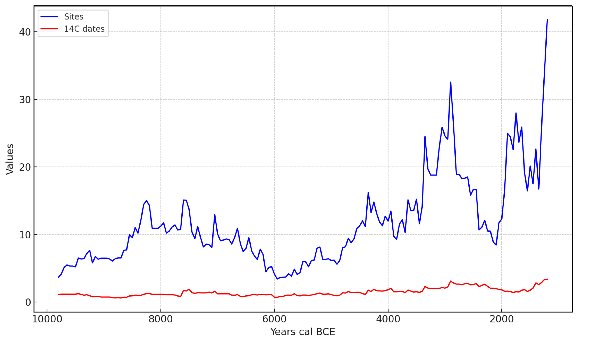

# **Towards Robust Demographic Models: A Systematic Framework to 14C Data Aggregation and Analysis with Lessons from the Southern Levant**

**Author/Principal Investigator Information**

**Name:** Magdalena M.E. Bunbury  
**ORCID:** [0000-0003-3114-3138](https://orcid.org/0000-0003-3114-3138)  
**Institution:** James Cook University (Adjunct)  
**Address:** Cairns, Queensland, Australia  
**Email:** [magdalena.bunbury@jcu.edu.au](mailto:magdalena.bunbury@jcu.edu.au)

## **Data Collection Timeline**

Primary data collection occurred from August 2019–March 2022, with additional database integration and dataset refinement from June 2022–May 2024.

**Geographic Location of Data Collection**

Southern Levant: southern Syria, Lebanon, Jordan, the West Bank, and Israel (**Fig. 1**).

**Fig. 1**. The spatial distribution of 561 georeferenced 14C-dated archaeological sites across the Southern Levant spanning the last 50,000 years.

**Funding Sources**

This research was supported by:

- Lehrstuhl in Zooarchaeology and Stable Isotope Biogeochemistry, Kiel University
- Cluster of Excellence "ROOTS" (EXC 2150 – 390870439), funded by Deutsche Forschungsgemeinschaft, DFG)
- Centre of Excellence “CABAH” (CE170100015), funded by the Australian Research Council, ARC

Neither DFG nor ARC had any role in study design, data collection, analysis, or publication decisions.

## **SHARING/ACCESS INFORMATION**

**License:** This dataset is released under the **Creative Commons License (CC-BY 4.0)**.

**DOI for dataset:** [Zenodo DOI](https://doi.org/10.5281/zenodo.14053394)

**GitHub Repository:** [Southern Levant 14C Dataset](https://github.com/MagdalenaBunbury/SouthernLevant)

**Recommended Citation:**  
Bunbury, M.M.E. 2025. Towards Robust Demographic Models: A Systematic Framework to 14C Data Aggregation and Analysis with Lessons from the Southern Levant, version 0.2 (29 January 2025). <https://github.com/MagdalenaBunbury/SouthernLevant>

**Major Contributing Databases & Datasets**

- [PPND](https://www.exoriente.org/associated_projects/ppnd.php) (Platform for Neolithic Radiocarbon Dates) – Benz, M., 2014
- [p3k14c](https://www.nature.com/articles/s41597-022-01118-7) (A global database of archaeological 14C dates) – Bird et al., 2022.
- [RADON](https://radon.ufg.uni-kiel.de/) (Central European Database of 14C dates for the Neolithic and Early Bronze Age) – Hinz et al., 2012.
- [NERD](https://openarchaeologydata.metajnl.com/articles/10.5334/joad.90) (Near East Radiocarbon Dates) – Palmisano et al., 2022.
- [ORAU](https://c14.arch.ox.ac.uk/database/db.php) (Oxford Radiocarbon Accelerator Unit online database) – University of Oxford.
- [CalPal](https://uni-koeln.academia.edu/BernhardWeninger/CalPal) (The Cologne Radiocarbon Calibration & Palaeoclimate Research Package) – Weninger et al. 2006.
- [D-REAMS](https://www.weizmann.ac.il/D-REAMS/scientific-publications) (Dangoor Research Accelerator Mass Spectrometry Laboratory) – Weizmann Institute of Science.
- Boaretto, E., Jull, A.T., Gilboa, A. and Sharon, I., 2005. [Dating the Iron Age I/II transition in Israel: first intercomparison results](https://www.cambridge.org/core/journals/radiocarbon/article/dating-the-iron-age-iii-transition-in-israel-first-intercomparison-results/9E4A579AAABD63C763F465CE83B2EA71). _Radiocarbon_, _47_(1), pp.39-55.
- Carmi, I., 1987. [Rehovot radiocarbon measurements III](https://www.cambridge.org/core/journals/radiocarbon/article/rehovot-radiocarbon-measurements-iii/E6DA39A5331F5F8EEE96B5773A3BA0CD). Radiocarbon, 29 (1), 100-114.
- Flohr, P., Fleitmann, D., Matthews, R., Matthews, W., and Black, S., 2016. [Evidence of resilience to past climate change in Southwest Asia: Early farming communities and the 9.2 and 8.2 ka events.](https://doi.org/10.1016/j.quascirev.2015.06.022) Quaternary Science Reviews 136 , pp. 23-39.
- Regev, J., De Miroschedji, P., Greenberg, R., Braun, E., Greenhut, Z. and Boaretto, E., 2012a. [Chronology of the Early Bronze Age in the southern Levant: new analysis for a high chronology](https://www.cambridge.org/core/journals/radiocarbon/article/chronology-of-the-early-bronze-age-in-the-southern-levant-new-analysis-for-a-high-chronology/B447FACD103BFFE3E9E1C3EB40934AFF). Radiocarbon 54 (3-4), pp.525-566.
- Segal, D., & Carmi, I., 1996. [Rehovot Radiocarbon Date List V](https://pascal-francis.inist.fr/vibad/index.php?action=getRecordDetail&idt=2881140). 'Atiqot, 29, 79-106.
- Segal, D. and Carmi, I., 2004. Rehovot radiocarbon date list VI.‘. Atiqot, 48, pp.123-148.
- Weinstein, J. M. (1984). [Radiocarbon dating in the southern Levant](https://www.cambridge.org/core/journals/radiocarbon/article/radiocarbon-dating-in-the-southern-levant/0086FF0E2C859B1064BC8FC782E928B0). Radiocarbon, 26(3), 297-366.

## **DATA & FILE OVERVIEW**

**File List**

- **SouthernLevant14C.csv** – 4,657 14C dates from 582 archaeological sites.
- **AoristicWeights14C.csv** – Probability distributions for each 50-year interval.
- **AoristicWeightsSites.csv** – Probability distributions for site occupations.
- **Ratio14CSites.csv** – Standardised probabilities with statistical metrics.
- **SouthernLevantReferences.csv** – Full reference list for 14C dates and sites.
- **SouthernLevantRcode –** R script for Summed Probability Distribution (SPD) analysis and visualization.

## **METHODOLOGICAL INFORMATION**

**Framework for Data Collection & Processing**

This dataset was generated using a **seven-step methodological framework** to ensure data consistency:

1. Radiocarbon dataset fusion – Integration of 14C dates from multiple sources.
2. Duplicate elimination – Standardisation of site names and removal of redundancies.
3. Dataset enhancement – Addition of geographical and environmental data.
4. Radiocarbon date categorization – Classification based on reliability criteria.
5. Outlier analysis – Identification of unreliable dates due to contextual or reservoir effects.
6. Limitation analysis – Application of aoristic weighting to address dataset biases.
7. SPD modelling & publication – Standardisation of 14C date ratios across time slices.

**Fig. 2** Seven-step methodological framework for 14C dataset generation and assessment. Key abbreviations include Marine Reservoir Effect (MRE), Marine Samples (MS), Terrestrial Samples with Inbuilt Age (TIA), and Terrestrial Short-Lived materials (TSL).

**Software & Tools Used**

- OxCal v4.4 ([OxCal Calibration](https://c14.arch.ox.ac.uk/oxcal.html))
- R v4.1+ (Rcarbon package) ([GitHub Repository](https://github.com/ahb108/rcarbon))
- Excel (for aoristic weighting calculations)

**Calibration & Environmental Controls**

- Terrestrial 14C dates were calibrated using IntCal20.
- Sites were classified by phytogeographic zones (Mediterranean, Irano-Turanian, Saharo-Arabian, Sudanean) and moisture categories (Mesic, Semi-arid, Arid) to address regional climate variability.

## **Quality Assurance Measures**

- Manual verification of geographical coordinates** using NERD, p3k14C, and Google Earth**.
- Cross-checking duplicate dates, lab IDs, and stratigraphic inconsistencies.
- Categorization of samples based on reliability, archaeological context, and material type.
- Aoristic weighting was applied to site occupations and 14C date distributions to account for potential biases, with a focus on the period 11,750–3,100 cal BP (9800–1150 BCE) (**Fig. 3**).

**Fig. 3** Aoristic weights of 14C-dated sites and 14C dates spanning 11,750–3,100 cal BP (9800–1150 BCE).

**People Involved**

- Magdalena M.E. Bunbury – Data collection, processing, and analysis (Kiel University, James Cook University).
- Cheryl Makarewicz – Provided guidance on data collection (Kiel University).

## **DATA-SPECIFIC INFORMATION FOR: SouthernLevant14C.csv**

**Number of variables:** 31

**Number of cases/rows:** 4,657 14C dates spanning the last 50,000 years.

**Variable List:**

| **Variable** | **Description** |
| --- | --- |
| **Site_ID / Site_Name** | Unique site identifier (alphabetical order). |
| **Latitude / Longitude** | Site coordinates in WGS84 decimal degrees. |
| **Phytogeographic_Zone** | Environmental classification based on vegetation zones. |
| **Temperature_Humidity** | Climatic classification (e.g., Mesic, Semi-arid, Arid). |
| **Subregion** | Geographic subregion within the Southern Levant. |
| **Lab_ID** | Unique radiocarbon laboratory identifier. |
| **CRA (BP)** | Conventional Radiocarbon Age (Before Present, BP). |
| **Error (± years)** | 1-sigma error margin in years. |
| **Material / Species / δ13C** | Organic material dated (e.g., charcoal, bone, seeds), species, and δ13C values if available. |
| **Context / Site_Function** | Archaeological context (e.g., stratigraphy) and site function (e.g., settlement, burial). |
| **Period / Culture** | Chronological period and cultural association, if applicable. |
| **Comments** | Notes on inconsistencies in databases, typological chronology, or data uncertainties. |
| **Classes** | Type of 14C sample (e.g., charcoal, bone, shell). |
| **Reliability_Class** | Categorization of reliability (1a, 1b, 2a, etc.). |
| **Exclusion_Reason** | Justification for marking a sample as an outlier (e.g., intrusive material). |
| **SPD_Included** | Indicates whether this 14C date is used for Summed Probability Distribution (SPD) analysis (Yes/No). |
| **Aoristic_Included** | Indicates whether this 14C date is used for Aoristic analysis (Yes/No). |
| **References and Databases** | \*X\* if the date is included in a specific database (e.g., NERD, PPND). |

**Abbreviations used:**

- Chalcolithic – Chalcolithic Period
- EBA (IA, IB, II, III, IV, IVA, IVB-C) – Early Bronze Age and its subdivisions
- E/M/LPPNB – Early/Middle/Late Pre-Pottery Neolithic B
- Ghassulian – Late Chalcolithic Culture
- IA (I, IA IIA-C, III) – Subdivisions of the Iron Age
- IBA – Intermediate Bronze Age
- Kebaran – Kebaran Culture (Epipaleolithic)
- LBA (I, IIA, IIB, III) – Subdivisions of the Late Bronze Age
- MBA (I, IIA, IIB, III) – Subdivisions of the Middle Bronze Age
- Mushabian – Mesolithic/Epipaleolithic Culture
- Natufian (Early, Late, Final) – Subdivisions of the Natufian Culture (Epipaleolithic)
- Nebekian – Upper Paleolithic Culture
- Nizzanan – Late Epipaleolithic Culture
- PPN (PPNA/B/C) – Pre-Pottery Neolithic and its subdivisions
- Roman / Byzantine – Roman and Byzantine Periods
- Yarmukian – Early Pottery Neolithic Culture
- Wadi Rabah – Late Pottery Neolithic Culture

## **DATA-SPECIFIC INFORMATION FOR: AoristicWeights14C.csv**

**Number of variables:** 188 (including 50-year interval probability calculations).

**Number of rows:** 2,650 (one per reliable 14C date).

**Variable List:**

| **Variable** | **Description** |
| --- | --- |
| **Lab_ID** | Unique radiocarbon laboratory identifier. |
| **Cal_BP and BCE_68% / 95%** | Calibrated age range at 68% and 95% probability in both cal BP and BCE. |
| **Earliest** | Earliest possible occupation year (cal BP, 95% probability). |
| **Latest** | Latest possible occupation year (cal BP, 95% probability). |
| **11750 cal BP - 3100 cal BP** | Aoristic weights for 50-year intervals from 11,750 BP to 3,100 cal BP. |
| **Aoristic_Sum** | Summed aoristic probability across all intervals. |

**Aoristic Weighting Calculations**

Occupation probabilities were calculated using the following Excel formula:

\=IF(AND(N$1>=$L3, N$1<=$K3), 1/((($K3-$L3)/50)+1), 0)

This ensures proportional distribution of occupation likelihood within calibrated age ranges.

## **DATA-SPECIFIC INFORMATION FOR: AoristicWeightsSites.csv**

**Number of variables:** 187 (including 50-year interval probability calculations).

**Number of rows:** 288 (one per archaeological site).

**Variable List:**

| **Variable** | **Description** |
| --- | --- |
| **Site_Name** | Name of the archaeological site. |
| **Earliest_Period** | Earliest period based on 14C dates. |
| **Latest_Period** | Latest period based on 14C dates. |
| **Chronology** | Chronology based on site interpretation. |
| **Hiatus_Occupation** | Occupation hiatus detected based on 14C dates. |
| **Earliest** | Earliest occupation in cal BP |
| **Latest** | Latest occupation in cal BP |
| **Number_Reliable_14C_Dates** | Total number of reliable 14C dates per site. |
| **Number_Intervals_Site** | Total number of occupied intervals per site. |
| **Probability_Occupied_Intervals** | Probability of site occupation per 50-year interval. |
| **Probability_11750 BP - Probability_3100 BP** | Aoristic weights for 50-year intervals from 11,750 cal BP to 3,100 cal BP. |
| **Aoristic_Sum** | Summed aoristic probability across all intervals. |

**Standardisation of Probabilities**

Probabilities were standardised in Excel using the following formulas:

- \=COUNTIF(R3:GU3,">0") // Counts the number of occupied 50-year intervals per site.
- \=1/P3 // Standardizes the probability per interval by calculating its inverse.

## **DATA-SPECIFIC INFORMATION FOR: Ratio14CSites.csv**

**Number of variables:** 174 (including 50-year interval probability calculations).

**Number of rows:** 7

**Variable List (Rows):**

| **Variable** | **Description** |
| --- | --- |
| **Summed_14C_Dates** | Total number of 14C dates summed across all sites. |
| **Summed_Sites** | Total number of archaeological sites included in the dataset. |
| **Actual_14C_per_Site** | Actual number of 14C dates per site. |
| **Average_14C_per_Site** | Average number of 14C dates per site. |
| **Mean_14C_Dates** | Mean (average) of all 14C dates within the dataset. |
| **Standard_Deviation_14C_Dates** | Standard deviation of 14C dates, indicating variation in 14C ages. |
| **Standardisation_Formula** | Formula applied to standardise 14C date distributions across intervals. |

**Standardisation of Probabilities**

Probabilities were standardised using:

\=AVERAGE(B3:FR3) // Calculates the mean probability

\=STDEV.P(B3:FR3) // Computes the standard deviation

\=(B3 – B7) / B8 // Standardizes each value relative to dataset mean and deviation

## **CONCLUSION & NEXT STEPS**

This dataset establishes a rigorous, standardised foundation for 14C-based demographic modelling, ensuring consistency and reliability in archaeological data analysis. Its adaptable framework can be applied to other large-scale datasets, enhancing cross-regional comparability. Future developments may focus on refining outlier detection methods and integrating regional climate modelling to further improve analytical precision.